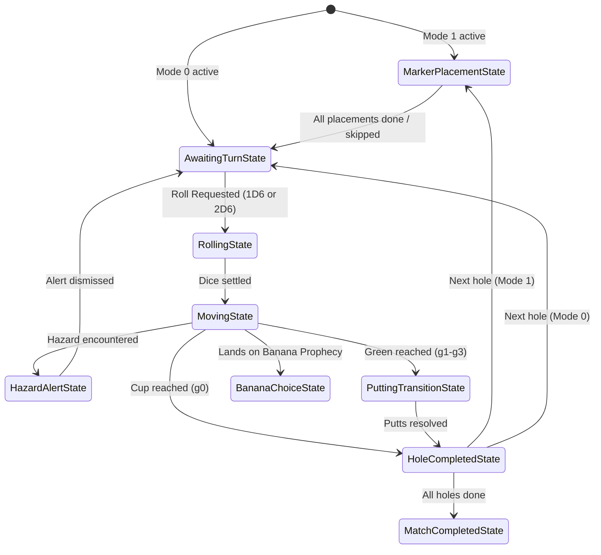

# 🎲 Paradox Golf: Systems Architecture & Game Specifications

This document serves as the comprehensive logical blueprint and systems specification for the **Paradox Golf** game. It details the exact mathematical models, state machines, terrain strategies, AI decision algorithms, and multiplayer synchronization rules required to implement the game on any platform or system.

---

## 🛠️ 1. Core State & Cycle Loop

Paradox Golf is built around a unidirectional data flow and a discrete Finite State Machine (FSM). The game state is updated by a central game coordinator, and the interface reacts deterministically to state changes.

### The Game Cycle Loop


---

## 🕹️ 2. Core Gameplay Modes & Turn Structure

The game coordinator operates in one of two modes:
1. **Mode 0 (Standard Play):** Traditional dice golf. Uses standard movement, terrain strategies, and putting transitions.
2. **Mode 1 (Wager Cards):** Advanced tactical duel. Includes a **Marker Placement Phase** at the start of each hole where players draft earned special cards onto the board.

### 🔄 Hole Play Turn Structure
Unlike traditional golf (where players alternate shots or the furthest from the pin plays first), **one player plays the entire hole from Tee Box to Green completion before the next player takes their turn.** 

#### Asymmetric Information Offset (AIO)
To mitigate the informational advantage of players who execute their turns later in the sequence, the following balancing mechanics are enforced:
1. **Execution Order Standings Rotation:** The execution order for the hole is strictly determined by the current standings. The player with the *highest* cumulative match score (the losing player) executes last ($P_{N-1}$), giving them the maximum information advantage. The leading player must execute first ($P_0$).
2. **First-Mover Score Offset:** The first executing player ($P_0$) receives a **$-0.5$ stroke deduction** applied to their hole score.
3. **Card Wager Compensation:** $P_0$ is awarded **1 free Guardian Shield card** at the start of the hole's Marker Placement phase.

* In a multiplayer match on a given hole, Player 0 takes consecutive shots until they land on the Green and resolve putting.
* Once Player 0 completes the hole, Player 1 starts at the Tee Box and plays the entire hole.
* This continues sequentially for all players.

### 🖥️ Bevy UI Layout Constraints (No DOM)
All UI overlays (such as turn notifications, standings, AIO statistics, and wager card drafting menus) must be implemented strictly inside Bevy's ECS using `bevy_ui` nodes (e.g. `Node`, `Text` components or version-specific layout engines) and standard resource states. 
* Absolutely no HTML/CSS, DOM webviews, or JavaScript wrappers are permitted.
* Styling properties must be defined natively in `client/src/ui/layout/` sub-modules.


---

## ⛳ 3. Standard Gameplay Mechanics & Terrain Strategies

The course is represented as a 1-based index linear track of **Space** coordinates. Position `0` is reserved for the **Tee Box** (which behaves like a Fairway) and is strictly a starting tile; after the first shot, a player's ball can never land on Space `0` again. The minimum active playable tile is Space `1`.


### 📖 Scorecard Vocabulary Standards
To eliminate ambiguity in score mutation operations, the game engine enforces three distinct scorecard metrics:
1. **Shot Stroke ($S_{shot}$):** The fundamental cost of taking a turn (initiating a dice roll). Every action that triggers a state transition out of `AwaitingTurnState` adds exactly **$+1$ Shot Stroke** to the scorecard.
2. **Penalty Stroke ($S_{penalty}$):** The additional cost applied to a player's scorecard by the terrain or card properties of the space they land on.
3. **Total Turn Strokes ($S_{total}$):** The mathematical sum added to the scorecard for the turn:
   $$S_{total} = S_{shot} + S_{penalty}$$

### 🎲 Dice Selection & Constraints
At the start of their turn, players select the range of their potential movement:
* **Standard spaces, Tees, Bunkers, Water, OB, and Greens:** Choice of rolling **1 or 2 dice** (represented as the set `{1, 2}`).
* **Rough spaces:** Enforces **exactly 1 die** (`{1}`).
* **Shield Override:** If the active player stands on their own active **Guardian Shield** token, the rough restriction is bypassed, allowing **1 or 2 dice**.

### 🧱 Terrain Strategy Design Pattern
Terrain-specific logic is isolated using a Strategy pattern that resolves two actions: **Movement From** (escape checks) and **Landing On** (resolving penalties and position updates).

```
TerrainResolutionStrategy
 ├── FairwayStrategy
 ├── RoughStrategy (Hazard - 1-die limit, Shield overrides)
 ├── BunkerStrategy (Odd roll fails escape, +1 stroke total, no movement)
 ├── WaterStrategy (Stays on tile, +2 strokes total)
 ├── OBStrategy (Resets position, +2 strokes total)
 └── GreenStrategy (Triggers hole completion & putting transition)
```

#### Detailed Terrain Resolutions

* **Fairway (`F`):**
  * *Landing:* $S_{shot} = 1$, $S_{penalty} = 0 \implies S_{total} = 1$. The ball remains on the target tile.
* **Rough (`R`):**
  * *Classification:* Considered a **Hazard** (permits Guardian Shield placement).
  * *Movement From:* Enforces **1-die-only** constraint (unless overridden by own Guardian Shield).
  * *Landing:* $S_{shot} = 1$, $S_{penalty} = 0 \implies S_{total} = 1$. The ball remains on the target tile.
* **Sand Bunker (`S`):**
  * *Classification:* Hazard.
  * *Movement From (Escape Check):* Player rolls chosen dice.
    * If the roll sum is **even**, the player escapes: $S_{shot} = 1$, $S_{penalty} = 0 \implies S_{total} = 1$. Position updates to roll destination.
    * If the roll sum is **odd**, the escape **fails**: $S_{shot} = 1$, $S_{penalty} = 0 \implies S_{total} = 1$. Position remains on the bunker tile (no movement occurs).
  * *Landing:* $S_{shot} = 1$, $S_{penalty} = 0 \implies S_{total} = 1$. The ball remains on the bunker tile.
* **Water Hazard (`W`):**
  * *Classification:* Hazard.
  * *Landing:* $S_{shot} = 1$, $S_{penalty} = 1 \implies S_{total} = 2$. The ball remains on the water tile.
  * *Movement From:* No escape check is required. The player takes their next shot from the water tile, $S_{shot} = 1$, $S_{penalty} = 0 \implies S_{total} = 1$, moving normally.
* **Lost Ball / Out-of-Bounds (`OB`):**
  * *Classification:* Hazard.
  * *Landing:* $S_{shot} = 1$, $S_{penalty} = 1 \implies S_{total} = 2$. The ball is reset back to the origin position from which the shot was taken.
* **Green Zone (`g0` - `g3`):**
  * *Landing:* Completes the hole. Adds **+1 Shot Stroke** ($S_{shot} = 1$) for the approach, followed by an automatic putting transition.
  * *Putting Transition:* Resolved fully deterministically and automatically. Additional putt strokes are added as penalty strokes ($S_{penalty} = \text{putts}$), immediately ending play on the hole:
    * ⛳ **Cup (Green 0):** `+0 Putts` ($S_{penalty} = 0 \implies S_{total} = 1$)
    * **Green 1:** `+1 Putt stroke` ($S_{penalty} = 1 \implies S_{total} = 2$)
    * **Green 2:** `+2 Putt strokes` ($S_{penalty} = 2 \implies S_{total} = 3$)
    * **Green 3:** `+3 Putt strokes` ($S_{penalty} = 3 \implies S_{total} = 4$)


---

### 🔄 Directional Physics (Overshoot & Undershoot Laws)
Player direction is tracked as state: `'forward'` (moving index-up) or `'reverse'` (moving index-down). Movement direction is deterministic and always oriented relative to the Green zone; the player never chooses or makes an active decision regarding direction of travel.

1. **Overshoot Law:** If a player is moving `forward` and their roll sum carries them past the maximum index of the Green zone (`maxGreenIndex`), they land on the target space (e.g. past the green) and their direction state toggles to `reverse` for their next turn.
2. **Undershoot Law:** If a player is moving `reverse` and their roll falls below the minimum index of the Green zone (`minGreenIndex`), they land on the target space and their direction toggles back to `forward` for their next turn.
3. **Tee Box Clamping:** If any roll or movement calculation carries a player below index `1`, the position is strictly clamped to **Space 1** (as the Tee Box at Space 0 is strictly a starting tile and can never be landed on after the first shot). In this event, their direction automatically toggles to `forward` for their next turn.


---

## 🛡️ 4. The Wager Card System (Mode 1)

In Wager Cards mode, players earn cards dynamically and draft them onto the course track to trigger properties when landed on.

### 🏆 Dynamic Card Earning
Players start the match with **0 cards** in their inventory. Wager cards are awarded to players at the completion of a hole based on their score relative to par:
* **Birdie (-1):** Unlocks 1 card. The card has a **1/3 chance** of being a Guardian Shield, **1/3 chance** of Trickster Banana, and **1/3 chance** of Golden Die.
* **Eagle (-2):** Unlocks 1 card. The card has a **50% chance** of being a Trickster Banana and **50% chance** of Golden Die.
* **Albatross / Hole-in-One (-3 or score of 1):** Unlocks 1 **Golden Die** card (100% chance).
* **Par or worse:** Unlocks **0 cards**.

### 📍 Marker Placement Phase
Before any dice are rolled on a new hole, players enter the placement phase:
* **Continuous Round-Robin:** The placement phase continues in round-robin order until all players have either run out of cards or chosen to skip. This allows players to place multiple cards.
* **Auto-Skip:** If a player has no cards in their match inventory, their placement turn is skipped.
* **Alternating Placement:** Placement order is hole-dependent: the first placer index is `currentHoleIndex % players.length`. Subsequent players place in round-robin order.
* **One Token Per Tile:** Only one card can be drafted per tile.
* **Placement Restrictions:**
  * 🛡️ **Guardian Shield** can be placed on any **Hazard** (`sand`, `water`, `lostBall`, and `rough`).
  * 🍌 **Trickster (Banana Slip)** and 🎲 **Golden Die** can **only** be placed on non-hazard track tiles (`fairway`).
  * 🍌 **Trickster (Banana Slip)** cannot be placed 4 spaces ahead of a `lostBall` (OB) space.
  * No wagers can be placed on the Tee box (Space 0) or Green tiles.

---

### 🛡️ Wager Card Effects
Landing on placed tokens executes a strategy dependent on the owner of the token relative to the active player. All tokens persist on the board for the entire duration of the hole; they are not consumed when triggered but instead track player trigger history.

#### 1. 🛡️ Guardian Shield
* **Prophecy (Owner Lands):** *Hazard Block & Card Draw*
  * Overrides the tile type to behave like a Fairway space in the movement engine. This neutralizes water/OB resets and hazard stroke penalties (the shot counts as 1 stroke, but the hazard's extra +1 penalty stroke and reset are not enforced).
  * Draws 1 random Wager Card from the registry (infinite supply, 1/3 probability each).
* **Trap (Opponent Lands):** *Toll Stroke*
  * Opponent suffers a **+1 Stroke penalty** added to their score.
  * Owner draws 1 Guardian Shield card.

#### 2. 🍌 Trickster (Banana Slip)
* **Prophecy (Owner Lands):** *Banana Choice*
  * Draws 1 random card (Banana or Golden Die).
  * Triggers the **Banana Choice Phase**, allowing the owner to choose to advance 0 to 4 spaces forward. The movement sum counts as 0 strokes, but standard hazard rules apply if they land on a hazard. The movement behaves exactly like regular movement (including overshoot, undershoot, and landing on other tokens/hazards).
* **Trap (Opponent Lands):** *The Banana Slip*
  * Opponent is **pushed back 4 spaces**. 
    * "Pushed back" means opposite of their current movement direction (`'forward'` -> index-down, `'reverse'` -> index-up).
    * If the target space is occupied by another card or is OB (`lostBall`), they **slide forward** (in the direction of the player's current movement state) tile-by-tile until landing on a valid space.
    * A **valid space** to end the slide is any space that is NOT OB (lostBall) and NOT occupied by another wager card.
    * If the target index is less than 1, it is strictly clamped to `1`, as the Tee Box (Space 0) is strictly a starting tile and cannot be landed on after the first shot.
    * If the final space they land on after the slide is a **Hazard** (Sand, Water, Rough) or a **Green**, they immediately trigger the corresponding state resolution (such as bunker escape checks, water hazard stroke penalties, or putting transitions).
    * Owner draws 2 Banana Slip cards.

##### 🔄 Stack-Allocated Slide Cycle Detection
To prevent infinite sliding loops (e.g. bouncing back and forth between slide triggers) and avoid dynamic heap allocations during the physics loop, the engine enforces a stack-allocated **SlideTracker**:
* The tracker stores up to `16` visited cells in a fixed-size array.
* If a cell index is visited twice within the same slide resolution, a cycle is detected.
* Upon cycle detection or exceeding the `16` slide limit, the slide loop is aborted, the ball is immediately reset to Space `1`, and the player suffers a **+2 Stroke penalty** ($S_{penalty} = 2$).
* **Client-Side Prediction:** To eliminate visual interpolation jitter, the client and server execute the identical deterministic `SlideTracker` rules. The client will predict slide resolutions locally, but overrides its local state if the server issues a corrective state snapshot.


```rust
// Struct specification for server/src/physics/slide.rs
pub const MAX_SLIDES: usize = 16;

#[derive(Default, Debug, Clone, PartialEq, Eq)]
pub struct SlideTracker {
    pub visited_cells: [Option<usize>; MAX_SLIDES],
    pub slide_count: usize,
}

impl SlideTracker {
    pub fn new() -> Self {
        Self {
            visited_cells: [None; MAX_SLIDES],
            slide_count: 0,
        }
    }

    /// Records a cell visit. Returns Err if a cycle is detected or limits are exceeded.
    pub fn record_and_check_cycle(&mut self, cell_index: usize) -> Result<(), SlideError> {
        if self.slide_count >= MAX_SLIDES {
            return Err(SlideError::LimitExceeded);
        }
        for i in 0..self.slide_count {
            if let Some(visited) = self.visited_cells[i] {
                if visited == cell_index {
                    return Err(SlideError::CycleDetected);
                }
            }
        }
        self.visited_cells[self.slide_count] = Some(cell_index);
        self.slide_count += 1;
        Ok(())
    }
}

#[derive(Debug, Clone, Copy, PartialEq, Eq)]
pub enum SlideError {
    CycleDetected,
    LimitExceeded,
}
```


#### 3. 🎲 Golden Die
* **Prophecy (Owner Lands):** *Golden Prophecy*
  * Reduces owner's hole score by **-2 Strokes**. (The running score during a hole can go negative, but the final score at the completion of a hole is clamped to a minimum of 1 stroke).
  * Owner draws 1 Golden Die card.
* **Trap (Opponent Lands):** *Devastating Toll*
  * Opponent suffers a **+2 Stroke penalty**.
  * Owner draws 1 Golden Die card.

---

### ⚖️ Additional Card Mechanics
* **Multi-Landing Rule:** Each card tracks triggered player identities and can trigger exactly once per player per hole (unless **Wager Persistence** is enabled as a match-level lobby setting, allowing infinite triggers).
* **Clearance:** All tokens are cleared from the board when the hole is completed.

---

## 🤖 5. AI Bot Decision Engine

The bot decision-making is modeled as a **Markov Decision Process (MDP)** solved via **Value Iteration**.

### Discretized State Space & Markov Property
To satisfy the Markov Property under Out-of-Bounds (OB) reset rules, the state space must track the starting position of the current shot (the origin). To prevent state-space explosion, the board is discretized into 1D cell indices. The state space $\mathcal{S}$ is represented as:
$$s = (x_{cell}, d, x_{origin\_cell})$$
Where:
* $x_{cell} \in \mathbb{N}$ is the current discretized cell index.
* $d \in \{\text{Forward}, \text{Reverse}\}$ is the current movement direction.
* $x_{origin\_cell} \in \mathbb{N}$ is the cell index from which the current shot was taken.

### Wager-Aware Reward Function
The AI is wager-aware. The reward function $R(s, a, s')$ accounts for both standard terrain strokes and the expected stroke utilities of landing on wager tokens:
$$R(s, a, s') = S_{shot} + S_{penalty} + \sum_{T \in \mathcal{T}(s')} \mathbb{E}[U(T, \text{player\_id})]$$
Where:
* $S_{shot} = 1$ is the shot stroke cost.
* $S_{penalty}$ is the terrain-specific penalty stroke cost (+1 for Water, +1 for OB, etc.).
* $\mathcal{T}(s')$ is the set of active wager tokens on the target space $s'$.
* $U(T, \text{player\_id})$ is the stroke utility of token $T$ for the active player:
  * Own Golden Die: $-2$ strokes.
  * Opponent's Golden Die: $+2$ strokes.
  * Opponent's Guardian Shield: $+1$ stroke.

### MDP Value Iteration Algorithm
At the start of its planning cycle, the engine computes the expected strokes to finish the hole for all states $s \in \mathcal{S}$ within a sliding planning window:

1. **Terminal States:** For any green zone space, $V(s) = S_{shot} + S_{penalty\_putting}(s)$.
2. **Non-Terminal States:** Initialize expected strokes as a heuristic distance: 
   $$V(s) = \frac{|x_{green} - x_{cell}|}{4.0} + 2.0$$
3. **Value Iteration Loop (50 sweeps):**
   For each sweep, update the value table:
   $$V_{k+1}(s) = \min_{a \in \mathcal{A}} \sum_{s'} P(s' \mid s, a) \left[ R(s, a, s') + V_k(s') \right]$$
   Where:
   * $\mathcal{A} = \{1\text{ die}, 2\text{ dice}\}$ (or $\{1\text{ die}\}$ if in Rough and not overridden by own Shield).
   * $P(s' \mid s, a)$ is the transition probability distribution. If the action $a$ lands on an OB tile, the transition maps back to $s' = (x_{origin\_cell}, d, x_{origin\_cell})$ with $S_{penalty} = 1$.

### ⚡ Asynchronous Solver Task Integration
To prevent value iteration from blocking Bevy's main thread and causing frame drops, the computation runs off-thread using Bevy's `AsyncComputeTaskPool`:
* **Epoch Validation:** Each calculation is associated with an incremental `state_epoch` ID. 
* **Staleness Verification:** When the solver task completes, the main thread compares the task's starting epoch with the current game state epoch. If the state has mutated mid-calculation (e.g. an opponent placed a wager card or bumped the bot via a slide cascade), the task output is discarded as stale.
* **Stale Fallback Heuristic:** If the policy is discarded as stale, the bot immediately falls back to a safe, greedy heuristic: rolling 1D6 targeting the nearest fairway or safe tile.

```rust
// Spec for server/src/ai/mdp_solver/mod.rs
use bevy::prelude::*;
use bevy::tasks::Task;

#[derive(Resource)]
pub struct MdpSolverTask {
    pub task: Task<Option<Vec<u8>>>, // Returns the computed policy mapping states to actions
    pub state_epoch: u32,            // Epoch version of the game board at task creation
}
```

### Action Selection
To choose between rolling 1 or 2 dice, the engine queries the expected values $EV_{1\text{D6}}$ and $EV_{2\text{D6}}$:
* **Optimal Action:** The action with the lower expected value.
* **Sub-Optimal Action:** The action with the higher expected value.
* **Difficulty Scaling:** A random value $r \in [0, 1)$ is evaluated against the bot's difficulty coefficient:
  * **Easy (0.40):** 40% chance of choosing the optimal action, 60% chance of making a mistake.
  * **Medium (0.70):** 70% chance of optimal action, 30% chance of mistake.
  * **Hard (0.90):** 90% chance of optimal action, 10% chance of mistake.
  * **Perfect (1.00):** Always selects the optimal action.

---


## 🌐 6. Multiplayer Synchronization & Match Length

Multiplayer matches utilize a sequenced event replication model to prevent state conflicts and ensure deterministic state convergence.

### Match Length & Sudden Death
* **Match Length:** A standard match consists of exactly **18 holes**.
* **Stroke Limit:** There is **no stroke limit** per hole; play continues until the green is reached.
* **Tie-Breaker:** If multiple players finish the 18 holes with the same lowest total stroke score, they enter **Sudden Death**. Tied players play one extra hole to determine the winner. If still tied, subsequent extra holes are played until a single winner is determined.

### Shared State Data Model
The synchronized room session encapsulates the following properties:
* **Session Attributes**: Room code, host player ID, current hole index, active player index, current status (Lobby, Playing, Completed).
* **Sync Attributes**: Sequence number (incremented sequentially on state mutations to drop stale incoming network snapshots), indicators for draft phase/banana choice state.
* **Match Inventory**: List of player objects tracking individual positions, directions, total stroke card tallies, connectivity status, and earned wager card inventories.
* **Placed Tokens**: Location list mapping placed token cards on the track, including owner ID, card type, and player trigger history.

### Event Queue & Sequence Synchronization
* **Sequence Ordering:** Incoming snapshots with sequence numbers less than or equal to the processed sequence are discarded. If a sequence gap is detected, a full state reconciliation is requested from the host.
* **Write Lock Guard:** Updates require active turn authority:
  * Only the active player is authorized to broadcast dice roll and movement outcomes.
  * Only the designated player in the draft cycle is authorized to broadcast token placement updates.
  * Out-of-turn write actions are rejected.
* **AI Bot Host Ownership:** The host executes all AI bot turns and broadcasts the resulting state updates. If the host disconnects, the host status migrates to the next connected player with the lowest ID.

### 🛡️ Authoritative Host Migration Protocol
If the host disconnects during a transition window (e.g. after broadcasting a roll state but before resolving movement), the game coordinator suspends execution and triggers host migration.

#### 1. Authoritative State Reconstruction
* The newly promoted host (the active client with the lowest player ID) is the **sole authority** for state reconstruction. Peer-to-peer state negotiation is forbidden to prevent injection of forged game states.
* **Client Input Buffering:** Clients continuously buffer their unacknowledged inputs for up to `120` frames (approx. 2 seconds at 60 FPS).
* **Handshake Phase:** Upon promotion, the new host requests handshakes from all clients. Each client submits its `MigrationHandshake` containing its buffered inputs.
* **Validation & Fast-Forward:** The new host executes a strict input validation check for every frame in the buffer (checking for duplicate sequence IDs, velocity range boundaries, and card ownership) and performs a fast-forward authoritative execution starting from the last verified server tick. Client-side computed state values are rejected.
* **Input Lock on Timeout:** If migration exceeds 120 frames, the clients immediately lock user inputs and render a `MigrationOverlay` UI block until the handshake reconciles.

#### 2. Type-Safe Serialization Schemas
All migration payloads are serialized/deserialized using `Postcard` and compile-time verified structs in the shared `protocol` crate:

```rust
// Spec for protocol/src/migration.rs
use serde::{Serialize, Deserialize};

#[derive(Serialize, Deserialize, Debug, Clone, PartialEq, Eq)]
pub struct ClientInputFrame {
    pub tick: u32,
    pub input_data: Vec<u8>, // Postcard-serialized player action payload
}

#[derive(Serialize, Deserialize, Debug, Clone, PartialEq, Eq)]
pub struct MigrationHandshake {
    pub current_term: u64,
    pub last_acknowledged_tick: u32,
    pub buffered_inputs: Vec<ClientInputFrame>,
}

#[derive(Serialize, Deserialize, Debug, Clone, PartialEq, Eq)]
pub struct MigrationStatePayload {
    pub state_tick: u64,
    pub serialized_world_state: Vec<u8>, // Postcard-serialized authoritative world state
}

#[derive(Debug, Clone, Copy, PartialEq, Eq)]
pub enum ValidationError {
    DuplicateInput,
    InvalidVelocity,
    UnownedCardActivation,
}
```


---

## 📂 7. Future Architectural File Layout

To ensure absolute compliance with the **300-Line Limit** for Rust source files, the project's logic and UI layouts are distributed across the following modular file structure:

### 1. `protocol` (Shared Crate)
*   `src/lib.rs` (Crate boundary re-exports and shared enums)
*   `src/migration.rs` (Host migration Postcard serialization structs and validation types)

### 2. `server` (Authoritative Game Server)
*   `src/main.rs` (Socket bootstrapper and core loop orchestrator)
*   `src/physics/slide.rs` (Stack-allocated `SlideTracker` cycle detection and clamping)
*   `src/physics/validation.rs` (InputValidator and physics boundary checks)
*   `src/ai/mdp_state.rs` (1D cell discretization and state vectors)
*   `src/ai/mdp_solver/mod.rs` (AI computation scheduler and async pool manager)
*   `src/ai/mdp_solver/transitions.rs` (Stochastic transition matrix modeling)
*   `src/ai/mdp_solver/iteration.rs` (Pure mathematical Bellman update sweeps)
*   `src/ai/mdp_solver/rewards.rs` (Wager-aware and terrain-specific utility matrices)
*   `src/ai/systems.rs` (Bevy ECS game loop wrappers and event dispatchers)

### 3. `client` (WASM Game Client)
*   `src/main.rs` (Bevy UI plugin and canvas bootstrapper)
*   `src/ui/mod.rs` (UI state controllers)
*   `src/ui/layout/mod.rs` (Styling property constants and node spawners)
*   `src/ui/layout/turn_order.rs` (Bevy native node structures for player order and AIO)
*   `src/ui/layout/wager.rs` (Bevy native UI trees for card selection and drafting)


---

## 📊 8. Match Telemetry, Analytics, & Leaderboard Specifications

This section defines the event-driven telemetry envelopes, data schemas, and analytics structures required to support game metrics, anti-cheat validation, and server-side global leaderboards.

### 📈 Telemetry Data Envelopes (Type-Safe Postcard Schema)
To ensure minimal network overhead and compile-time compatibility, all game events emit structured payloads defined in the `protocol` crate.

```rust
// Spec for protocol/src/telemetry.rs
use serde::{Serialize, Deserialize};

#[derive(Serialize, Deserialize, Debug, Clone, PartialEq, Eq)]
pub struct TelemetryHeader {
    pub match_id: [u8; 16],      // UUID v4 of the match session
    pub player_id: u64,          // Unique ID of the acting player
    pub timestamp_ms: u64,       // Unix epoch timestamp
    pub hole_index: u8,          // Current hole (0-17)
}

/// Emitted at the completion of each hole by each player.
#[derive(Serialize, Deserialize, Debug, Clone, PartialEq, Eq)]
pub struct HolePerformanceEvent {
    pub header: TelemetryHeader,
    pub shot_strokes: u8,        // Sum of S_shot
    pub penalty_strokes: u8,     // Sum of S_penalty (hazards, cards, resets)
    pub putts_taken: u8,         // Number of automatic putting strokes
    pub gir: bool,               // Green in Regulation (landed on Green in <= Par - 2 shots)
    pub scrambling: bool,        // Saved Par or better after landing in >= 1 Hazard (Bunker, Water, OB)
}

/// Emitted whenever a wager card is drafted or triggered.
#[derive(Serialize, Deserialize, Debug, Clone, PartialEq, Eq)]
pub struct CardWagerEvent {
    pub header: TelemetryHeader,
    pub card_type: u8,           // 0: Guardian Shield, 1: Banana, 2: Golden Die
    pub cell_index: u32,         // Position of placement
    pub trigger_outcome: u8,     // 0: Draft, 1: Prophecy (Owner), 2: Trap (Opponent)
    pub stroke_delta: i8,        // Cost added or subtracted to scorecard
}

/// Emitted by the physics engine on boundary overrides or loops.
#[derive(Serialize, Deserialize, Debug, Clone, PartialEq, Eq)]
pub struct PhysicsAnomalyEvent {
    pub header: TelemetryHeader,
    pub anomaly_type: u8,        // 0: Clamp to Space 1, 1: Loop Reset to Space 1
    pub start_cell: u32,
    pub total_slides: u8,        // Slide count prior to clamping/reset
}

/// Emitted by the server-side AI solver on decision completion.
#[derive(Serialize, Deserialize, Debug, Clone, PartialEq, Eq)]
pub struct AiSolverMetrics {
    pub header: TelemetryHeader,
    pub elapsed_millis: u32,     // Compute time for Value Iteration
    pub states_evaluated: u32,   // Planning window size |S|
    pub staleness_triggered: bool, // True if policy was discarded due to mid-turn state change
    pub fallback_executed: bool,  // True if safe heuristic took over
}
```

### 🏆 Persistent Profile Record Schema
The server maintains a persistent record of player profiles to drive matchmaking and leaderboard indices:

```rust
// Spec for server/src/db/profile.rs
pub struct PlayerProfileRecord {
    pub player_id: u64,
    pub matches_played: u32,
    pub matches_won: u32,
    pub hole_in_one_count: u32,
    pub total_albatrosses: u32,
    pub total_eagles: u32,
    pub total_birdies: u32,
    pub average_putts_per_hole: f32,
    pub scrambling_success_rate: f32,
    pub handicap_index: f32,     // Server-calculated competitive handicap
}
```

### 🧮 Competitive Handicap Index Formula
To establish an equitable global leaderboard, the server dynamically calculates a **Paradox Handicap Index** modeled after professional golf regulations, adjusted for dice probability:

1. **Hole Differential ($D_h$):** For each completed match, the server calculates the differential for the best 8 of the last 20 matches.
   $$D_h = \sum_{h=0}^{17} \left( S_{total, h} - \text{Par}_h \right) \times \text{DifficultyFactor}_{\text{course}}$$
2. **Handicap Calculation:**
   $$\text{Handicap Index} = \text{Average}(D_{h, \text{best 8}}) \times 0.96$$
3. **Usage:** The global leaderboard ranks players strictly by their `Handicap Index` (lowest score differential), ensuring that match performance across different course configurations is normalized.

### 📡 Server Telemetry Pipeline
1. **Authoritative Collection:** The server's main loop captures events during state mutations and pushes them to a lock-free, non-blocking queue (`crossbeam_channel::Sender<TelemetryEvent>`).
2. **Off-Thread Logging:** An asynchronous worker thread drains the queue and serializes payloads into compression-ready logs or submits them to external endpoints, ensuring zero impact on the 60 Hz physics/network tick rate.


