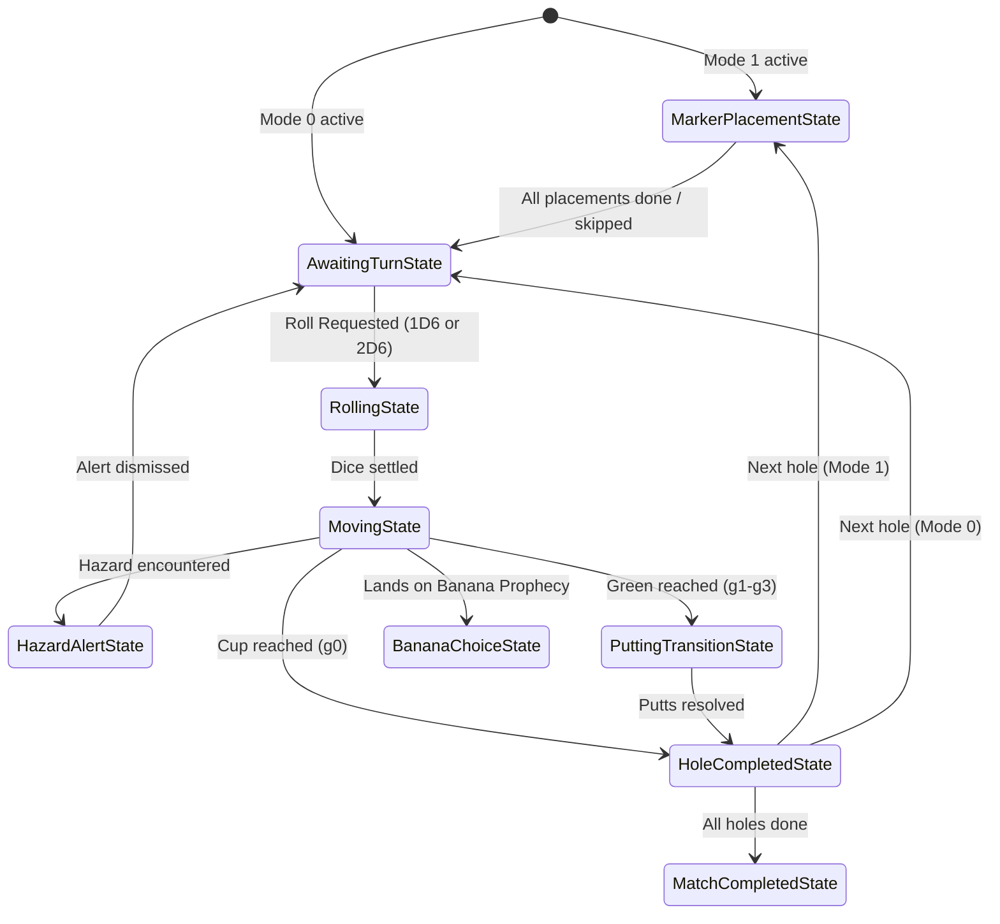

# 🎲 Paradox Golf: Systems Architecture & Game Specifications

This document serves as the comprehensive logical blueprint and systems specification for the **Paradox Golf** game. It details the exact mathematical models, state machines, terrain strategies, AI decision algorithms, and multiplayer synchronization rules required to implement the game on any platform or system.

---

## 🛠️ 1. Core State & Cycle Loop

Paradox Golf is built around a unidirectional data flow and a discrete Finite State Machine (FSM). The game state is updated by a central game coordinator, and the interface reacts deterministically to state changes.

### The Game Cycle Loop


---

## 🕹️ 2. Core Gameplay Modes & Turn Structure

The game coordinator operates in one of two modes:
1. **Mode 0 (Standard Play):** Traditional dice golf. Uses standard movement, terrain strategies, and putting transitions.
2. **Mode 1 (Wager Cards):** Advanced tactical duel. Includes a **Marker Placement Phase** at the start of each hole where players draft earned special cards onto the board.

### 🔄 Hole Play Turn Structure
Unlike traditional golf (where players alternate shots or the furthest from the pin plays first), **one player plays the entire hole from Tee Box to Green completion before the next player takes their turn.** 
* In a multiplayer match on a given hole, Player 0 takes consecutive shots until they land on the Green and resolve putting.
* Once Player 0 completes the hole, Player 1 starts at the Tee Box and plays the entire hole.
* This continues sequentially for all players.

---

## ⛳ 3. Standard Gameplay Mechanics & Terrain Strategies

The course is represented as a 1-based index linear track of **Space** coordinates. Position `0` is reserved for the **Tee Box** (which behaves like a Fairway).

### 🎲 Dice Selection & Constraints
At the start of their turn, players select the range of their potential movement:
* **Standard spaces, Tees, Bunkers, Water, OB, and Greens:** Choice of rolling **1 or 2 dice** (represented as the set `{1, 2}`).
* **Rough spaces:** Enforces **exactly 1 die** (`{1}`).
* **Shield Override:** If the active player stands on their own active **Guardian Shield** token, the rough restriction is bypassed, allowing **1 or 2 dice**.

### 🧱 Terrain Strategy Design Pattern
Terrain-specific logic is isolated using a Strategy pattern that resolves two actions: **Movement From** (escape checks) and **Landing On** (resolving penalties/states).

```
TerrainResolutionStrategy
 ├── FairwayStrategy
 ├── RoughStrategy (Hazard - 1-die limit, Shield overrides)
 ├── BunkerStrategy (Odd roll fails escape, +1 stroke total, no movement)
 ├── WaterStrategy (Stays on tile, +2 strokes total)
 ├── OBStrategy (Resets position, +2 strokes total)
 └── GreenStrategy (Triggers hole completion & putting transition)
```

#### Detailed Terrain Resolutions

* **Fairway (`F`):**
  * *Landing:* Adds **+1 Stroke** to the scorecard. Ball remains on tile.
* **Rough (`R`):**
  * *Classification:* Considered a **Hazard** (which permits Guardian Shield placement).
  * *Movement From:* Enforces **1-die-only** constraint (unless overridden by player's own Guardian Shield).
  * *Landing:* Adds **+1 Stroke** to the scorecard. Ball remains on tile.
* **Sand Bunker (`S`):**
  * *Classification:* Hazard.
  * *Movement From (Escape Check):* Player rolls their chosen dice. 
    * If the roll sum is **even**, the player escapes (resolve movement normally).
    * If the roll sum is **odd**, the escape **fails**: the player's position is unchanged, and they suffer a **+1 Stroke** total penalty for the turn (i.e. the shot itself counts as 1 stroke, with no additional penalty).
  * *Landing:* Adds **+1 Stroke** to the scorecard. Ball remains on tile.
* **Water Hazard (`W`):**
  * *Classification:* Hazard.
  * *Landing:* Adds a **+1 penalty stroke** on top of the shot stroke (total **+2 Strokes** added for the turn). The ball remains on the water tile.
  * *Movement From:* No escape check is required. The player takes their next shot from the water tile choosing 1 or 2 dice, and moves normally.
* **Lost Ball / Out-of-Bounds (`OB`):**
  * *Classification:* Hazard.
  * *Landing:* Adds a **+1 penalty stroke** on top of the shot stroke (total **+2 Strokes** added for the turn). The ball is reset back to the position from which the shot was taken.
* **Green Zone (`g0` - `g3`):**
  * *Landing:* Completes the hole. Adds **+1 Stroke** for the shot, followed by an automatic putting transition.
  * *Putting Transition:* Resolved fully deterministically and automatically. Additional putt strokes are added to the scorecard based on the green category, immediately ending play on the hole:
    * ⛳ **Cup (Green 0):** `+0 Putts`
    * **Green 1:** `+1 Putt stroke`
    * **Green 2:** `+2 Putt strokes`
    * **Green 3:** `+3 Putt strokes`

---

### 🔄 Directional Physics (Overshoot & Undershoot Laws)
Player direction is tracked as state: `'forward'` (moving index-up) or `'reverse'` (moving index-down).
1. **Overshoot Law:** If a player is moving `forward` and their roll sum carries them past the maximum index of the Green zone (`maxGreenIndex`), they land on the target space (e.g. past the green) and their direction state toggles to `reverse` for their next turn.
2. **Undershoot Law:** If a player is moving `reverse` and their roll falls below the minimum index of the Green zone (`minGreenIndex`), they land on the target space and their direction toggles back to `forward` for their next turn.

---

## 🛡️ 4. The Wager Card System (Mode 1)

In Wager Cards mode, players earn cards dynamically and draft them onto the course track to trigger properties when landed on.

### 🏆 Dynamic Card Earning
Players start the match with **0 cards** in their inventory. Wager cards are awarded to players at the completion of a hole based on their score relative to par:
* **Birdie (-1):** Unlocks 1 card. The card has a **1/3 chance** of being a Guardian Shield, **1/3 chance** of Trickster Banana, and **1/3 chance** of Golden Die.
* **Eagle (-2):** Unlocks 1 card. The card has a **50% chance** of being a Trickster Banana and **50% chance** of Golden Die.
* **Albatross / Hole-in-One (-3 or score of 1):** Unlocks 1 **Golden Die** card (100% chance).
* **Par or worse:** Unlocks **0 cards**.

### 📍 Marker Placement Phase
Before any dice are rolled on a new hole, players enter the placement phase:
* **Continuous Round-Robin:** The placement phase continues in round-robin order until all players have either run out of cards or chosen to skip. This allows players to place multiple cards.
* **Auto-Skip:** If a player has no cards in their match inventory, their placement turn is skipped.
* **Alternating Placement:** Placement order is hole-dependent: the first placer index is `currentHoleIndex % players.length`. Subsequent players place in round-robin order.
* **One Token Per Tile:** Only one card can be drafted per tile.
* **Placement Restrictions:**
  * 🛡️ **Guardian Shield** can be placed on any **Hazard** (`sand`, `water`, `lostBall`, and `rough`).
  * 🍌 **Trickster (Banana Slip)** and 🎲 **Golden Die** can **only** be placed on non-hazard track tiles (`fairway`).
  * 🍌 **Trickster (Banana Slip)** cannot be placed 4 spaces ahead of a `lostBall` (OB) space.
  * No wagers can be placed on the Tee box (Space 0) or Green tiles.

---

### 🛡️ Wager Card Effects
Landing on placed tokens executes a strategy dependent on the owner of the token relative to the active player. All tokens persist on the board for the entire duration of the hole; they are not consumed when triggered but instead track player trigger history.

#### 1. 🛡️ Guardian Shield
* **Prophecy (Owner Lands):** *Hazard Block & Card Draw*
  * Overrides the tile type to behave like a Fairway space in the movement engine. This neutralizes water/OB resets and hazard stroke penalties (the shot counts as 1 stroke, but the hazard's extra +1 penalty stroke and reset are not enforced).
  * Draws 1 random Wager Card from the registry (infinite supply, 1/3 probability each).
* **Trap (Opponent Lands):** *Toll Stroke*
  * Opponent suffers a **+1 Stroke penalty** added to their score.
  * Owner draws 1 Guardian Shield card.

#### 2. 🍌 Trickster (Banana Slip)
* **Prophecy (Owner Lands):** *Banana Choice*
  * Draws 1 random card (Banana or Golden Die).
  * Triggers the **Banana Choice Phase**, allowing the owner to choose to advance 0 to 4 spaces forward. The movement sum counts as 0 strokes, but standard hazard rules apply if they land on a hazard. The movement behaves exactly like regular movement (including overshoot, undershoot, and landing on other tokens/hazards).
* **Trap (Opponent Lands):** *The Banana Slip*
  * Opponent is **pushed back 4 spaces**. 
    * "Pushed back" means opposite of their current movement direction (`'forward'` -> index-down, `'reverse'` -> index-up).
    * If the target space is occupied by another card or is OB (`lostBall`), they **slide forward** (in the direction of the player's current movement state) tile-by-tile until landing on a valid space.
    * A **valid space** to end the slide is any space that is NOT OB (lostBall) and NOT occupied by another wager card.
    * If the final space they land on after the slide is a **Hazard** (Sand, Water, Rough) or a **Green**, they immediately trigger the corresponding state resolution (such as bunker escape checks, water hazard stroke penalties, or putting transitions).
  * Owner draws 2 Banana Slip cards.

#### 3. 🎲 Golden Die
* **Prophecy (Owner Lands):** *Golden Prophecy*
  * Reduces owner's hole score by **-2 Strokes**. (The running score during a hole can go negative, but the final score at the completion of a hole is clamped to a minimum of 1 stroke).
  * Owner draws 1 Golden Die card.
* **Trap (Opponent Lands):** *Devastating Toll*
  * Opponent suffers a **+2 Stroke penalty**.
  * Owner draws 1 Golden Die card.

---

### ⚖️ Additional Card Mechanics
* **Multi-Landing Rule:** Each card tracks triggered player identities and can trigger exactly once per player per hole (unless **Wager Persistence** is enabled as a match-level lobby setting, allowing infinite triggers).
* **Clearance:** All tokens are cleared from the board when the hole is completed.

---

## 🤖 5. AI Bot Decision Engine

The bot decision-making is modeled as a **Markov Decision Process (MDP)** solved via **Value Iteration**.

### MDP Value Iteration Algorithm
At the start of each hole, the engine computes the expected strokes to finish the hole for all states $s = (\text{position}, \text{direction})$:

1. **Terminal States:** For any green zone space, $V(s) = \text{puttScore}(s)$.
2. **Non-Terminal States:** Initialize expected strokes as a heuristic distance: 
   $$V(s) = \frac{|\text{spacesLength} - p|}{4.0} + 2.0$$
3. **Value Iteration Loop (50 sweeps):**
   For each sweep, update the value table:
   $$V_{k+1}(s) = \min_{a \in \mathcal{A}} \sum_{s'} P(s' | s, a) \left[ R(s, a, s') + V_k(s') \right]$$
   Where:
   * $\mathcal{A} = \{1\text{ die}, 2\text{ dice}\}$ (or $\{1\text{ die}\}$ if in Rough and not overridden by own Shield).
   * $P(s' | s, a)$ is the roll probability (flat $\frac{1}{6}$ for 1D6; standard 2D6 triangular distribution for 2D6).
   * $R(s, a, s')$ is the stroke increment resulting from the move.
   * If a bunker escape fails, $s'$ loops back to $s$.
   * **Simplification:** The MDP bot ignores wager tokens during Value Iteration, calculating its optimal path based solely on the static terrain types (Fairway, Rough, Sand, Water, OB, Green).

### Action Selection
To choose between rolling 1 or 2 dice, the engine queries the expected values $EV_{1\text{D6}}$ and $EV_{2\text{D6}}$:
* **Optimal Action:** The action with the lower expected value.
* **Sub-Optimal Action:** The action with the higher expected value.
* **Difficulty Scaling:** A random value $r \in [0, 1)$ is evaluated against the bot's difficulty coefficient:
  * **Easy (0.40):** 40% chance of choosing the optimal action, 60% chance of making a mistake.
  * **Medium (0.70):** 70% chance of optimal action, 30% chance of mistake.
  * **Hard (0.90):** 90% chance of optimal action, 10% chance of mistake.
  * **Perfect (1.00):** Always selects the optimal action.

---

## 🌐 6. Multiplayer Synchronization & Match Length

Multiplayer matches utilize a sequenced event replication model to prevent state conflicts and ensure deterministic state convergence.

### Match Length & Sudden Death
* **Match Length:** A standard match consists of exactly **18 holes**.
* **Stroke Limit:** There is **no stroke limit** per hole; play continues until the green is reached.
* **Tie-Breaker:** If multiple players finish the 18 holes with the same lowest total stroke score, they enter **Sudden Death**. Tied players play one extra hole to determine the winner. If still tied, subsequent extra holes are played until a single winner is determined.

### Shared State Data Model
The synchronized room session encapsulates the following properties:
* **Session Attributes**: Room code, host player ID, current hole index, active player index, current status (Lobby, Playing, Completed).
* **Sync Attributes**: Sequence number (incremented sequentially on state mutations to drop stale incoming network snapshots), indicators for draft phase/banana choice state.
* **Match Inventory**: List of player objects tracking individual positions, directions, total stroke card tallies, connectivity status, and earned wager card inventories.
* **Placed Tokens**: Location list mapping placed token cards on the track, including owner ID, card type, and player trigger history.

### Event Queue & Sequence Synchronization
* **Sequence Ordering:** Incoming snapshots with sequence numbers less than or equal to the processed sequence are discarded. If a sequence gap is detected, a full state reconciliation is requested from the host.
* **Write Lock Guard:** Updates require active turn authority:
  * Only the active player is authorized to broadcast dice roll and movement outcomes.
  * Only the designated player in the draft cycle is authorized to broadcast token placement updates.
  * Out-of-turn write actions are rejected.
* **AI Bot Host Ownership:** The host executes all AI bot turns and broadcasts the resulting state updates. If the host disconnects, the host status migrates to the next connected player with the lowest ID.
