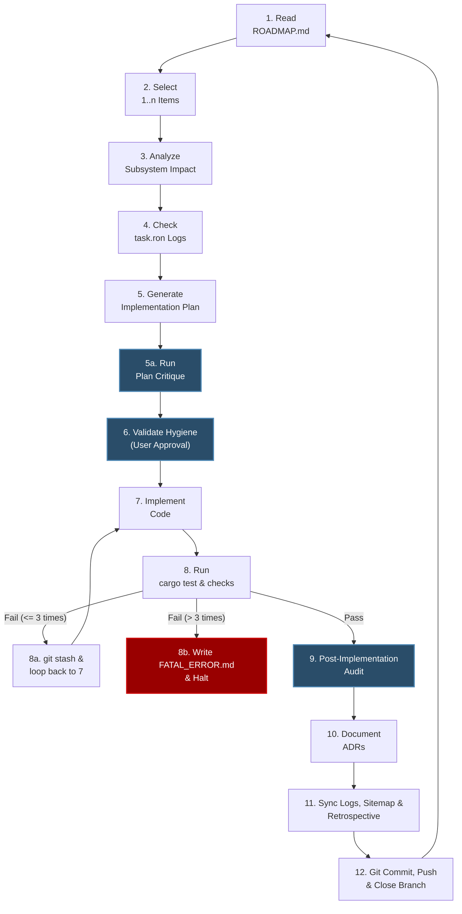

# The Creator-Agent Paradigm Shift: Setup & Process

Welcome to the **Paradox Plus** engine. This project transitions developers into **Creators**—systems designers who orchestrate, audit, and direct the development loop, leveraging AI agents as high-fidelity direct binary mutation engines.

To maintain perfect engineering quality, avoid "AI context drift", and enforce strict zero-overhead compilation limits, all contributions must adhere to our automated 12-step state machine.

---

## 🗺️ The Operational State Machine

This diagram visualizes our closed-loop engineering process with verification loopback logic:



---

## ⚙️ Initial Creator Setup

Before modifying code, complete the following environment setup.

### 1. Install the Antigravity CLI (agy)
For automated plan critiques, the critique tool routes prompts through Antigravity's native CLI (`agy`), leveraging the IDE's built-in model config and credentials.
To install the CLI, run:
```bash
curl -fsSL https://antigravity.google/cli/install.sh | bash
```

### 2. Verify Environment Variables
Ensure `ANTIGRAVITY_LS_ADDRESS` is set in your active terminal session. Integrated IDE terminals set this automatically. If you are using an external terminal, manually export the address (e.g., `export ANTIGRAVITY_LS_ADDRESS=localhost:<port>`).

---

## 🛠️ Workspace Commands & Tools

 We have integrated our plan critique tooling directly into the project's build automation via the `Makefile`:

### 1. Automated Implementation Plan Critique
Before presenting a plan for user approval, query the Gemini API for a deep systems-level reasoning audit. This checks for logic bugs, architecture constraints, and rule compliance:
```bash
make critique-plan
```
* **Output:** Saves the review to `implementation_plan_critique.md` in your active conversation directory.
* **Resilience Fallback:** If rate-limiting (e.g. 429 Errors) or network outages cause `make critique-plan` to fail, the Agent must perform a manual systems-level audit and write the critique directly to `implementation_plan_critique.md`. This ensures safety checks are still performed without halting iteration velocity.

### 2. Verification & WASM Target Compilation Check
To verify that changes are fully compatible with both native and web targets, use cargo to test and check compilation targets:
```bash
# Run unit tests and integration tests
cargo test

# Verify WASM target compatibility for client and protocol crates
cargo check -p client -p protocol --target wasm32-unknown-unknown
```

### 3. Core Engine Hygiene Guardrails
The iteration protocol strictly enforces the following guardrails:
*   **300-Line Limit & Submodule Separation:** No individual Rust source file (excluding test suites or benchmarks) may exceed 300 lines of code. Split files into granular submodules (e.g., `mod.rs`, `components.rs`, `systems.rs`, `events.rs`) within a module folder when they approach this limit. Verify file sizes using `wc -l`.
*   **Pure Rust ECS (No DOM):** Absolutely never use HTML, CSS, JavaScript, WebViews, or DOM elements. The inclusion of DOM-specific crates (e.g., `web-sys`, `std::web`) in client packages is strictly prohibited. All UI representation, rendering, and interaction must occur natively inside Bevy (`bevy_ui` + Taffy + WGSL shaders).
*   **Authoritative Server Validation & Fixed-Point Math:** All gameplay state mutations, card draws, and movement resolutions must be evaluated on the authoritative Server. The Client only renders interpolated states. To prevent cross-platform desyncs (Native vs. WASM), all simulation/physics calculations must use fixed-point arithmetic (`fixed::types::I32F32` from the `fixed` crate) or integer math. Floating-point operations (`f32`/`f64`) are strictly banned in gameplay logic. Because fixed-point multiplication/division is susceptible to overflow, game logic must use safe arithmetic operations (like `checked_add`, `checked_mul`, or `saturating_mul`) instead of standard math operators (`+`, `*`).
*   **Fixed-to-Float Render Bridge:** The client-side presentation mapping must explicitly translate fixed-point positions into Bevy's native floating-point `Transform` components via a read-only translation system (`FixedToFloatPlugin`) in Bevy's `PostUpdate` phase. Under no circumstances may client-side render systems write to or mutate authoritative fixed-point coordinate state components.
*   **WASM Safety & Allocation Optimization:** Client crates must register `console_error_panic_hook::set_once()` upon entry. To prevent WASM heap exhaustion, avoid custom dynamic heap allocations (such as instantiating raw `Vec`, `HashMap`, or `.clone()` calls) inside hot loop systems. Reuse collection vectors by utilizing Bevy's `Local<Vec<T>>` resources, and ensure they are explicitly cleared (`vec.clear()`) at the start or end of each system run to prevent stale state bugs and memory leaks. Defer game state transitions to playing modes until all asset handles are completely loaded.
*   **Type-Safe & Bounded Serialization:** All network payloads must be serialized/deserialized using `Postcard` and compile-time verified structs/enums shared in the `protocol` crate. Enforce a maximum packet size of 64KB (`MAX_PACKET_SIZE = 65536`) at the connection layer. All serialized types must use bounded sizes (e.g. `heapless::Vec`, `heapless::String`, or static arrays) to prevent deserialization memory attacks. Deserialization errors must drop the connection/packet safely without panicking.
*   **Test-Driven Architecture (TDA):** Every physics mutation, scorecard operation, AI solver feature, or serialization payload must have a corresponding test target in the same PR/commit. No logic changes may be shipped without matching unit or integration coverage as specified in `/doc/testing_strategy.md`.

---

## 📋 The Type-Safe `task.ron` Standard

To eliminate "AI context drift" and ensure LLM agents process checklists without layout or state hallucinations, checklists are stored in [Rust Object Notation (RON)](https://github.com/ron-rs/ron) format.

### Task Schema Definition
The tasks file must parse against this Rust structure:
```rust
pub enum Subsystem {
    Protocol(String),
    Server(String),
    Client(String),
}

pub enum TaskStatus {
    Pending,
    InProgress,
    Completed,
}

pub struct Task {
    pub id: String,
    pub subsystem: Subsystem,
    pub status: TaskStatus,
    pub dependencies: Vec<String>,
    pub affects_files: Vec<String>,
    pub verification_cmd: String,
}
```

### Example task.ron Checklist
```ron
[
    Task(
        id: "phys_01",
        subsystem: Protocol("physics"),
        status: InProgress,
        dependencies: ["core_02"],
        affects_files: [
            "crates/protocol/src/physics.rs"
        ],
        verification_cmd: "cargo test -p protocol --test physics_tests"
    )
]
```
During **Step 4 (Audit Tasks)** and **Step 11 (Sync)**, agents read, modify, and type-check this configuration file, guaranteeing perfect machine-readability.
